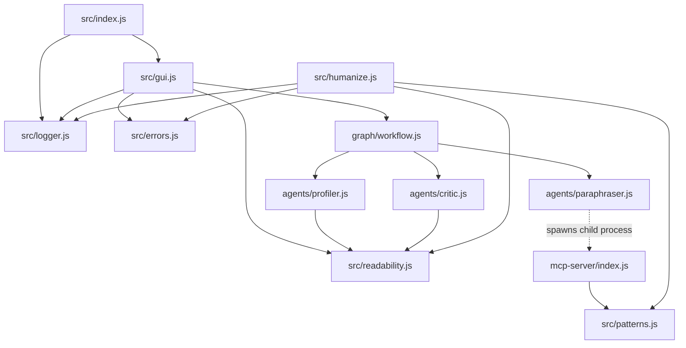

# ClarityOS: Architectural Blueprint & Technical Breakdown

This document provides a textbook-level architectural breakdown of the **ClarityOS** codebase. It is designed to get a Principal Systems Architect or Senior Staff Engineer up to speed on the core business domain, system boundaries, code skeleton, execution mechanics, and operational complexities.

---

## Phase 1: The Executive Blueprint

### 1. The Core Problem

Complex institutional text — such as medical discharge instructions, legal contracts, insurance policies, and government forms — often uses vocabulary and syntax that is difficult for general audiences or patients to understand. Manual rewriting to plain language is slow, costly, and highly inconsistent.

ClarityOS solves this by providing an **agentic plain language compliance tool** that rewrites complex text to meet **Flesch-Kincaid readability standards**. It targets:

| Grade  | Target FK | Max Avg Sentence Length | Use Case                                          |
| ------ | --------- | ----------------------- | ------------------------------------------------- |
| **6**  | ≤ 6.0     | 14 words                | Healthcare, children's content                    |
| **8**  | ≤ 8.0     | 18 words                | General public, government (US Plain Writing Act) |
| **10** | ≤ 10.0    | 22 words                | Legal, technical/professional                     |

The system tracks Flesch-Kincaid readability metrics, calculates and displays the simplification delta, and functions both as an **interactive web-based GUI** (a retro terminal dashboard) and as an **integration-ready Model Context Protocol (MCP) server**.

### 2. High-Level Tech Stack

| Layer                     | Technology                                                                                                                                                                                                                                                                     |
| ------------------------- | ------------------------------------------------------------------------------------------------------------------------------------------------------------------------------------------------------------------------------------------------------------------------------ |
| **Runtime**               | Node.js (ES Modules, `"type": "module"`)                                                                                                                                                                                                                                       |
| **Language**              | Vanilla JavaScript (ES6+ ESModules throughout)                                                                                                                                                                                                                                 |
| **Protocol Support**      | Model Context Protocol (MCP) SDK `v1.12.x` — JSON-RPC over stdio transport                                                                                                                                                                                                     |
| **Agentic Orchestration** | `@langchain/langgraph` `v1.4.x` — managing a `StateGraph` with conditional cycles                                                                                                                                                                                              |
| **Inference Pipeline**    | **Gemini 2.5 Flash** (via `@langchain/google-genai` `v2.2.x`, keyed by `GOOGLE_API_KEY` / `GEMINI_API_KEY`) for the Profiler and Critic nodes. **Llama-3-8B-Instruct** (via `@huggingface/inference` `v4.13.x`, keyed by `HUGGINGFACEHUB_API_TOKEN`) for the Paraphraser node. |
| **Validation**            | `Zod` `v3.25.x` for runtime request validation (HTTP API) and MCP tool schema checking                                                                                                                                                                                         |
| **HTTP Server**           | Built-in `node:http` — zero external framework dependencies                                                                                                                                                                                                                    |
| **GUI**                   | Server-side rendered single HTML page with embedded CSS + vanilla JS, served inline from `gui.js`                                                                                                                                                                              |

### 3. Dependency Philosophy

ClarityOS deliberately avoids heavyweight frameworks. There is **no Express, no Fastify, no React, no bundler**. The HTTP layer is raw `node:http`. The GUI is a single inline HTML document. The entire codebase is ~15 files of vanilla ES6 JavaScript. This keeps the dependency surface minimal and the runtime footprint lean.

---

## Phase 2: The Skeleton & Entry Points

### 1. Macro Directory Structure

```
clarityos/
├── package.json              # Project manifest, scripts, dependencies
├── .env / .env.example       # Runtime secrets (API keys, port)
├── .gitignore
├── LICENSE                   # ISC
├── README.md
│
├── src/                      # Core application layer
│   ├── index.js              # ① Main CLI entry point — env loading + server boot
│   ├── gui.js                # ② HTTP server, API router, inline dashboard HTML
│   ├── readability.js        # ③ Flesch-Kincaid metric calculator
│   ├── patterns.js           # ④ Grade-tiered regex replacement dictionaries
│   ├── humanize.js           # ⑤ Deterministic heuristic pre-pass pipeline
│   ├── errors.js             # ⑥ Custom ValidationError / ProcessingError classes
│   └── logger.js             # ⑦ Stderr-only structured logger
│
├── graph/                    # LangGraph orchestration layer
│   └── workflow.js           # ⑧ StateGraph compilation — node wiring + conditional edges
│
├── agents/                   # LangGraph node implementations (the "agents")
│   ├── profiler.js           # ⑨ Gemini-powered complexity analyzer
│   ├── paraphraser.js        # ⑩ Llama-3 rewriter + MCP client for pattern fetching
│   └── critic.js             # ⑪ Score-gate evaluator + Gemini qualitative reviewer
│
└── mcp-server/               # Standalone MCP server process
    └── index.js              # ⑫ Stdio JSON-RPC server exposing get_plain_language_patterns
```

### 2. Execution Entry Points & Lifecycle

The application has **two distinct entry points**, reflecting its dual personality:

#### Entry Point A: The Web Application (`npm start`)

```
node src/index.js
       │
       ├── process.loadEnvFile()          ← loads .env into process.env
       ├── Validates GEMINI_API_KEY / GOOGLE_API_KEY presence (warns on stderr)
       ├── Validates HUGGINGFACEHUB_API_TOKEN presence (warns on stderr)
       └── startGuiServer(port)
              │
              ├── http.createServer()     ← raw Node.js HTTP server
              ├── GET /                   → renderPage() → inline HTML dashboard
              ├── GET /health             → { ok: true, timestamp }
              ├── POST /api/humanize      → handleHumanize() → graph.invoke()
              └── OPTIONS *               → CORS preflight (204)
```

#### Entry Point B: The MCP Server (`npm run mcp`)

```
node mcp-server/index.js
       │
       ├── Instantiates @modelcontextprotocol/sdk Server
       ├── Registers ListToolsRequestSchema handler → exposes tool manifest
       ├── Registers CallToolRequestSchema handler  → dispatches get_plain_language_patterns
       └── Connects to StdioServerTransport         → JSON-RPC over stdin/stdout
```

> [!IMPORTANT]
> These two entry points are **independent processes**. The MCP server is not started by `src/index.js`. Instead, the **Paraphraser agent** spawns the MCP server as a child process on-demand (via `StdioClientTransport`) during each rewrite pass, then tears it down after receiving patterns.

### 3. The Inline GUI Architecture

The entire dashboard UI lives inside [`src/gui.js`](file:///c:/Users/rishi/ClarityOS/src/gui.js) as a **template literal function** `renderPage()` that returns a complete `<!doctype html>` document. This monolithic approach means:

- **No static file serving** — zero disk reads for assets.
- **No build step** — no Webpack, Vite, or compilation required.
- **No CDN dependencies at runtime** — except Google Fonts (IBM Plex Sans / IBM Plex Mono).
- **CSS is embedded** — a full design system (~600 lines) with CSS custom properties, grid layouts, responsive breakpoints, animations, and scrollbar styling.
- **JS is embedded** — client-side state management, DOM manipulation, `fetch()` to `/api/humanize`, typewriter text animation, score animation via `requestAnimationFrame`, and pipeline step status tracking.

**Design Language**: Dark-mode cyberpunk terminal aesthetic. Color palette uses GitHub's dark primitives (`#0d1117`, `#161b22`, `#1c2128`) with semantic accent colors (green for success, amber for processing, red for error, purple for critic, blue for profiler).

---

## Phase 3: Data Flow & Agentic Mechanics

### 1. The Multi-Agent Plain Language Loop

When a rewrite request hits `POST /api/humanize`, the data undergoes loop-based processing:

```
┌──────────────────────────────────────────────────────────────────┐
│                        CLIENT (Browser)                          │
│  User pastes text → selects grade → clicks TRANSMIT              │
└────────────────────────────┬─────────────────────────────────────┘
                             │ POST /api/humanize { text, gradeLevel }
                             ▼
┌──────────────────────────────────────────────────────────────────┐
│                     gui.js — handleHumanize()                    │
│  1. Zod validation (HumanizeRequestSchema)                       │
│  2. Calculate baseline FK score (calculateFK)                    │
│  3. graph.invoke({ rawText, gradeLevel, ... })                   │
└────────────────────────────┬─────────────────────────────────────┘
                             ▼
┌──────────────────────────────────────────────────────────────────┐
│              LangGraph StateGraph (workflow.js)                  │
│                                                                  │
│  START ──→ [PROFILER] ──→ [PARAPHRASER] ──→ [CRITIC] ──→ ?       │
│                                                  │               │
│                            ┌─────────────────────┤               │
│                            │                     │               │
│                    status="rejected"      status="approved"      │
│                    AND iterations < 4     OR iterations >= 4     │
│                            │                     │               │
│                            ▼                     ▼               │
│                     [PARAPHRASER]              [END]             │
│                            │                                     │
│                            └──→ [CRITIC] ──→ ?                   │
│                                  (loop)                          │
└──────────────────────────────────────────────────────────────────┘
                             │
                             ▼ { draftText, readabilityScores, iterations }
┌──────────────────────────────────────────────────────────────────┐
│                     gui.js — Response Assembly                   │
│  1. Extract afterFK from result (or recalculate)                 │
│  2. Return { result, plainText, readabilityScores, iterations }  │
└────────────────────────────┬─────────────────────────────────────┘
                             │ JSON response
                             ▼
┌──────────────────────────────────────────────────────────────────┐
│                        CLIENT (Browser)                          │
│  Typewriter output animation → Score widget → Delta display      │
└──────────────────────────────────────────────────────────────────┘
```

### 2. Agent Deep Dive

#### Agent 1: Profiler ([`agents/profiler.js`](file:///c:/Users/rishi/ClarityOS/agents/profiler.js))

| Aspect           | Detail                                                                                                                                                                                                                                                                                                                                                                                                               |
| ---------------- | -------------------------------------------------------------------------------------------------------------------------------------------------------------------------------------------------------------------------------------------------------------------------------------------------------------------------------------------------------------------------------------------------------------------- |
| **LLM**          | Gemini 2.5 Flash (`@langchain/google-genai`)                                                                                                                                                                                                                                                                                                                                                                         |
| **Temperature**  | 0.3 (low variance, deterministic analysis)                                                                                                                                                                                                                                                                                                                                                                           |
| **Input**        | `state.rawText`, `state.gradeLevel`                                                                                                                                                                                                                                                                                                                                                                                  |
| **Output**       | `{ directive, readabilityScores: { before, after: null }, status: "profiled" }`                                                                                                                                                                                                                                                                                                                                      |
| **Purpose**      | Computes baseline FK score, then sends the raw text to Gemini with a structured system prompt requesting analysis of: reading difficulty, long sentences (>25 words), passive voice, jargon, and nominalization patterns. Produces a structured editing `directive` with sections: `TARGET_GRADE`, `CURRENT_GRADE`, `PROBLEM_PATTERNS`, `LONG_SENTENCES`, `PASSIVE_VOICE`, `VOCABULARY_TIER`, `SENTENCE_COMPLEXITY`. |
| **Lazy Loading** | `ChatGoogleGenerativeAI` is dynamically imported via `await import()` inside the node function, avoiding module-level instantiation failures when API keys are absent.                                                                                                                                                                                                                                               |

#### Agent 2: Paraphraser ([`agents/paraphraser.js`](file:///c:/Users/rishi/ClarityOS/agents/paraphraser.js))

| Aspect                 | Detail                                                                                                                                                                                                                                                                                                                                                       |
| ---------------------- | ------------------------------------------------------------------------------------------------------------------------------------------------------------------------------------------------------------------------------------------------------------------------------------------------------------------------------------------------------------ |
| **LLM**                | Meta Llama-3-8B-Instruct (via `@huggingface/inference` `HfInference.chatCompletion`)                                                                                                                                                                                                                                                                         |
| **Temperature**        | 0.7 (higher variance for creative rewriting)                                                                                                                                                                                                                                                                                                                 |
| **Max Tokens**         | 1024                                                                                                                                                                                                                                                                                                                                                         |
| **Input**              | `state.draftText ?? state.rawText`, `state.directive`, `state.gradeLevel`                                                                                                                                                                                                                                                                                    |
| **Output**             | `{ draftText, status: "paraphrased" }`                                                                                                                                                                                                                                                                                                                       |
| **MCP Integration**    | Before invoking the LLM, the Paraphraser spawns a **child process** running `mcp-server/index.js` via `StdioClientTransport`, calls `get_plain_language_patterns` with the current `gradeLevel`, parses the JSON response, and injects up to 30 regex-based replacement rules directly into the system prompt as explicit `"Replace X with Y"` instructions. |
| **Custom LLM Wrapper** | Does NOT use LangChain's built-in HuggingFace wrapper. Instead, defines a custom `ChatHuggingFace` class that lazily initializes `HfInference` and calls `hf.chatCompletion()` directly. This gives fine-grained control over the chat message format.                                                                                                       |
| **Fallback**           | If MCP connection fails, the Paraphraser proceeds with an empty pattern set (degrades gracefully).                                                                                                                                                                                                                                                           |

#### Agent 3: Critic ([`agents/critic.js`](file:///c:/Users/rishi/ClarityOS/agents/critic.js))

| Aspect                 | Detail                                                                                                                                                                                                                                                                                                                                            |
| ---------------------- | ------------------------------------------------------------------------------------------------------------------------------------------------------------------------------------------------------------------------------------------------------------------------------------------------------------------------------------------------- | --------------------------------------------------------------- |
| **LLM**                | Gemini 2.5 Flash (conditionally invoked)                                                                                                                                                                                                                                                                                                          |
| **Temperature**        | 0.2 (very low variance, strict evaluation)                                                                                                                                                                                                                                                                                                        |
| **Input**              | `state.draftText`, `state.gradeLevel`, `state.directive`, `state.readabilityScores`                                                                                                                                                                                                                                                               |
| **Output**             | `{ status: "approved"                                                                                                                                                                                                                                                                                                                             | "rejected", directive (amended), readabilityScores (updated) }` |
| **Score Gate**         | Computes the FK grade of `draftText`. If `afterScore <= gradeLevel`, immediately returns `status: "approved"` **without calling Gemini**. This is a critical cost/latency optimization.                                                                                                                                                           |
| **Qualitative Review** | If the score gate fails, invokes Gemini with a review prompt requesting specific, actionable feedback on: complex sentences, word replacements, passive voice, and remaining jargon. The feedback is appended to the existing `directive` as a `--- CRITIC FEEDBACK (Iteration) ---` block, which the Paraphraser will see on the next loop pass. |
| **Loop Throttle**      | Always sleeps for **2000ms** at the start of execution (`await new Promise(resolve => setTimeout(resolve, 2000))`) to prevent API rate limiting during rapid loop iterations.                                                                                                                                                                     |

### 3. State & Channels

The [`StateGraph`](file:///c:/Users/rishi/ClarityOS/graph/workflow.js) state is defined with vanilla JavaScript config channels:

```javascript
const workflowStateConfig = {
  channels: {
    rawText: null, // The original input text (immutable across iterations)
    directive: null, // Profiler's analysis + Critic's cumulative feedback
    draftText: null, // The working copy — mutated by Paraphraser each pass
    status: null, // Transition flag: "profiled" | "paraphrased" | "approved" | "rejected"
    gradeLevel: null, // Target FK grade: "6" | "8" | "10"
    readabilityScores: null, // { before: number, after: number | null }
    iterations: null, // Loop counter (incremented by criticWithIterations wrapper)
  },
};
```

**Key observation**: The `directive` channel acts as an **accumulating context window**. Each Critic rejection appends feedback, so by iteration N, the Paraphraser's system prompt contains the original Profiler analysis plus N-1 rounds of Critic feedback — a form of **progressive refinement through prompt accumulation**.

### 4. Loop Control & Termination

The [`shouldContinue`](file:///c:/Users/rishi/ClarityOS/graph/workflow.js#L30-L49) function implements a two-condition exit strategy:

```
IF status === "approved"  →  END   (quality threshold met)
IF iterations >= 4        →  END   (safety valve — prevents infinite loops)
ELSE                      →  route back to "paraphraser"
```

The `criticWithIterations` wrapper increments the iteration counter before the Critic executes, ensuring the counter is always accurate.

### 5. Dynamic MCP Patterns & Tool Binding

The MCP integration follows a **spawn-per-request** architecture:

```
Paraphraser (agents/paraphraser.js)
       │
       ├── Resolves absolute path to mcp-server/index.js
       ├── Creates StdioClientTransport({ command: "node", args: [mcpServerPath] })
       │     └── Spawns child process: node mcp-server/index.js
       ├── Creates MCP Client ("clarityos-paraphraser-client" v1.0.0)
       ├── client.connect(transport)        ← JSON-RPC handshake over stdio
       ├── client.callTool({
       │     name: "get_plain_language_patterns",
       │     arguments: { gradeLevel }
       │   })
       ├── Parses JSON response → Array<{ find, replace, flags }>
       ├── transport.close()                ← Kills child process
       └── Injects patterns into LLM system prompt
```

**RegExp Serialization**: Since JavaScript `RegExp` objects cannot be serialized to JSON, the MCP server maps each pattern's `regex.source` property (the pattern string) and `regex.flags` property to produce a JSON-safe `{ find, replace, flags }` structure. The Paraphraser consumes the `find` and `replace` fields as natural language instructions in the prompt rather than reconstructing `RegExp` objects.

---

## Phase 4: The Heuristic Pre-Pass Engine

### 1. Purpose

Before any LLM is invoked, ClarityOS can run a **deterministic heuristic pre-pass** via [`src/humanize.js`](file:///c:/Users/rishi/ClarityOS/src/humanize.js). This module performs regex-based word/phrase replacements using the pattern dictionaries from [`src/patterns.js`](file:///c:/Users/rishi/ClarityOS/src/patterns.js).

> [!NOTE]
> In the current architecture, the HTTP API route (`POST /api/humanize`) invokes the LangGraph pipeline directly and does **not** run `humanizeText()` as a pre-pass. The `humanize.js` module exists as a standalone utility and can be used independently or integrated as a pre-processing step before the agentic workflow.

### 2. Pattern Architecture

[`src/patterns.js`](file:///c:/Users/rishi/ClarityOS/src/patterns.js) defines a hierarchical pattern system:

```
commonPatterns (45 entries)        ← Shared across all grade levels
    │
    ├── grade6Patterns  = commonPatterns + 39 medical/clinical terms
    ├── grade8Patterns  = commonPatterns + 42 legal/bureaucratic terms
    └── grade10Patterns = commonPatterns + 16 nominalization patterns

fillerPatterns (6 entries)         ← Applied after grade-specific patterns
```

**Pattern structure**: Each entry is `{ regex: RegExp, replacement: string }` where regex uses `\b` word boundaries and the `gi` flags (global, case-insensitive).

**Case preservation**: The `preserveCase()` function in `humanize.js` detects whether the matched word was ALL-CAPS or Title-Case and applies the same casing to the replacement. This prevents "UTILIZE" from becoming "use" (it becomes "USE").

### 3. Processing Pipeline

```
Input text
    │
    ├── 1. Apply grade-specific patterns (getPatternsByGrade)
    ├── 2. Apply filler phrase removal (fillerPatterns)
    ├── 3. Sentence-level simplification (humanizeSentence)
    │       └── Grade 6 only: replace formal openers
    │           ("Additionally," → "Also,", "However," → "But,", etc.)
    ├── 4. Collapse repeated words (collapseRepeats)
    ├── 5. Normalize whitespace
    └── Output { plainText, changes[], metrics: { before, after } }
```

---

## Phase 5: The Flesch-Kincaid Calculator

### 1. The Formula

[`src/readability.js`](file:///c:/Users/rishi/ClarityOS/src/readability.js) implements the standard **Flesch-Kincaid Grade Level** formula:

```
FK Grade = 0.39 × (words / sentences) + 11.8 × (syllables / words) − 15.59
```

### 2. Syllable Counting Heuristic

The `countSyllables(word)` function uses a regex-based heuristic rather than a dictionary lookup:

1. Strip non-alpha characters and lowercase.
2. If word ≤ 3 characters → return 1 syllable.
3. Strip silent endings: non-vowel + `es`, `ed`, non-vowel + `e`.
4. Strip leading `y`.
5. Count vowel clusters (`[aeiouy]{1,2}`) as syllables.
6. Return `max(1, count)`.

> [!WARNING]
> This heuristic is an approximation. It will miscount syllables for irregular words (e.g., "area" = 3 syllables but may count as 2). For a compliance-grade system, consider integrating a pronunciation dictionary (e.g., CMU Pronouncing Dictionary) as a future enhancement.

### 3. Sentence Splitting

`splitSentences(text)` uses the regex `/[^.!?]+[.!?]*/g` — splitting on terminal punctuation. This is a naive splitter that does not handle abbreviations (e.g., "Dr.", "U.S.A.") or decimal numbers gracefully.

---

## Phase 6: The HTTP Server & API Surface

### 1. Server Architecture

[`src/gui.js`](file:///c:/Users/rishi/ClarityOS/src/gui.js) implements a **zero-dependency HTTP server** using `node:http`:

```javascript
const server = http.createServer(async (req, res) => { ... });
```

**Route table**:

| Method    | Path            | Handler            | Purpose                           |
| --------- | --------------- | ------------------ | --------------------------------- |
| `GET`     | `/`             | `renderPage()`     | Serves the inline HTML dashboard  |
| `GET`     | `/health`       | Inline             | Returns `{ ok: true, timestamp }` |
| `POST`    | `/api/humanize` | `handleHumanize()` | Triggers the LangGraph pipeline   |
| `OPTIONS` | `*`             | Inline             | CORS preflight (204)              |
| `*`       | `*`             | Inline             | 404 JSON response                 |

### 2. Request Validation

The `/api/humanize` endpoint uses **Zod** for runtime validation:

```javascript
const HumanizeRequestSchema = z.object({
  text: z.string().min(1).max(10000), // 1–10,000 characters
  gradeLevel: z.enum(["6", "8", "10"]).default("8"),
});
```

If validation fails, a `400` response is returned with the Zod issue details. The `gradeLevel` defaults to `"8"` (US Plain Writing Act standard) if not provided.

### 3. CORS Policy

Every JSON response includes permissive CORS headers:

```
Access-Control-Allow-Origin: *
Access-Control-Allow-Methods: GET, POST, OPTIONS
Access-Control-Allow-Headers: Content-Type
```

This allows the dashboard to be accessed from any origin, including local development tools and browser extensions.

---

## Phase 7: The MCP Server

### 1. Architecture

[`mcp-server/index.js`](file:///c:/Users/rishi/ClarityOS/mcp-server/index.js) implements a standalone **Model Context Protocol** server:

- **Transport**: `StdioServerTransport` — reads JSON-RPC from `stdin`, writes to `stdout`.
- **Protocol**: MCP SDK `v1.12.x` — uses `ListToolsRequestSchema` and `CallToolRequestSchema` handlers.
- **Logging**: All logs go to `stderr` via a local `log()` function (critical — see Phase 8).

### 2. Exposed Tool

| Property         | Value                                                                 |
| ---------------- | --------------------------------------------------------------------- |
| **Name**         | `get_plain_language_patterns`                                         |
| **Input Schema** | `{ gradeLevel: "6" \| "8" \| "10" }` (validated by Zod strict schema) |
| **Output**       | `Array<{ find: string, replace: string, flags: string }>`             |
| **Data Source**  | `src/patterns.js` — `getPatternsByGrade(gradeLevel)`                  |

### 3. RegExp Serialization Strategy

JavaScript `RegExp` objects are not JSON-serializable. The MCP server solves this by extracting:

```javascript
const serialisablePatterns = gradePatterns.map((p) => ({
  find: p.regex.source, // e.g., "\\butilize\\b"
  replace: p.replacement, // e.g., "use"
  flags: p.regex.flags, // e.g., "gi"
}));
```

This produces a portable JSON representation that any downstream consumer can use — either as raw string matching rules or by reconstructing `new RegExp(find, flags)`.

---

## Phase 8: Critical Complexities & "Gotchas"

### 1. Stdio Collision Risk in MCP Mode

The MCP protocol communicates over **stdin/stdout**. Any stray `console.log()` call that writes to `stdout` will **corrupt the JSON-RPC stream**, breaking the client connection with parse errors.

> [!CAUTION]
> **ALL logs, trace messages, and server notifications MUST be directed exclusively to `stderr`.** The codebase enforces this in three ways:
>
> 1. [`src/logger.js`](file:///c:/Users/rishi/ClarityOS/src/logger.js) writes exclusively via `process.stderr.write()`.
> 2. [`mcp-server/index.js`](file:///c:/Users/rishi/ClarityOS/mcp-server/index.js) defines a local `log()` helper that writes to `process.stderr`.
> 3. All agent files (`profiler.js`, `paraphraser.js`, `critic.js`, `workflow.js`) use `console.error()` instead of `console.log()`.

### 2. LLM Lazy Loading & ESM Load Order

LangChain client wrappers will throw errors during module initialization if API keys are missing or invalid. ClarityOS mitigates this with two patterns:

- **Lazy Dynamic Imports**: `ChatGoogleGenerativeAI` is loaded via `await import("@langchain/google-genai")` **inside** the node functions at runtime — not at module parse time. This means the Profiler and Critic modules can be safely imported even when `GOOGLE_API_KEY` is unset.
- **Environment Population Order**: `process.loadEnvFile()` runs in `src/index.js` **before** any module that uses environment variables is invoked. The `.env` file is loaded synchronously, wrapped in a try/catch to gracefully handle missing files.

```javascript
// src/index.js — runs FIRST
try {
  process.loadEnvFile();
} catch (e) {}

// agents/profiler.js — runs LATER, inside graph.invoke()
const { ChatGoogleGenerativeAI } = await import("@langchain/google-genai");
const model = new ChatGoogleGenerativeAI({
  apiKey: process.env.GEMINI_API_KEY || process.env.GOOGLE_API_KEY, // populated by now
});
```

### 3. Flesch-Kincaid Score Gate Optimization

The Critic implements a **short-circuit evaluation**. Before invoking the expensive Gemini API call, it checks:

```javascript
if (afterScore <= Number(gradeLevel)) {
  // Immediately approve — no Gemini invocation needed
  return { status: "approved", ... };
}
```

This means: if the Paraphraser already produced text at or below the target grade level, the Critic skips the qualitative review entirely. On average, this saves **one Gemini API call per successful iteration** — significant for both latency and cost.

### 4. Loop Throttling

The Critic's 2000ms sleep (`await new Promise(resolve => setTimeout(resolve, 2000))`) serves two purposes:

1. **Rate limit protection**: Prevents rapid-fire API calls to Gemini when the loop cycles quickly.
2. **Child process stability**: Gives the MCP server child process time to fully terminate between Paraphraser invocations.

### 5. MCP Child Process Lifecycle

Each Paraphraser invocation spawns a **new** MCP server child process and tears it down after receiving patterns. This is a **spawn-per-request** model, not a long-lived connection. Implications:

- **No connection pooling** — every MCP call pays the Node.js process startup cost.
- **No state leakage** — each request gets a fresh process with no leftover state.
- **Graceful degradation** — if the MCP server fails to start, the Paraphraser catches the error and proceeds with an empty pattern set.

### 6. Dual API Key Support

The codebase supports two environment variable names for the same Google API key:

```javascript
apiKey: process.env.GEMINI_API_KEY || process.env.GOOGLE_API_KEY;
```

This accommodates both the Gemini-specific key name and the broader Google API key convention. The startup warning in `src/index.js` checks for both and only warns if **neither** is set.

### 7. Custom HuggingFace Wrapper

The Paraphraser does **not** use LangChain's community HuggingFace wrapper (`@langchain/community`). Instead, it defines a custom `ChatHuggingFace` class that:

1. Lazily initializes `HfInference` via dynamic import.
2. Calls `hf.chatCompletion()` directly with explicit `{ role, content }` message format.
3. Extracts `response.choices[0].message.content` — matching the OpenAI-compatible response format that HuggingFace's inference API returns.

This gives full control over token limits, temperature, and message formatting without LangChain's abstraction overhead.

### 8. No Persistent State

ClarityOS is **entirely stateless**. There is no database, no file-based storage, no session management, and no caching. Every request is processed from scratch. The `Logger` class maintains an in-memory ring buffer of the last 100 log entries (via `this.logs`), but this is purely for debugging inspection and is not persisted.

---

## Phase 9: Frontend Client Architecture

### 1. State Management

The dashboard uses **vanilla JavaScript module-scope variables** for state:

```javascript
let selectedGrade = "8"; // Current grade level selection
let selectedDocType = "medical"; // Current document type (UI-only, not sent to API)
let isProcessing = false; // Lock flag to prevent concurrent requests
let logCount = 1; // Log entry counter
let loadingDotsInterval = null; // Reference to the "PROCESSING..." animation timer
```

### 2. UI Interaction Flow

```
User clicks TRANSMIT
    │
    ├── Lock UI (isProcessing = true, disable button)
    ├── Reset pipeline step indicators
    ├── Show "BEFORE" text panel with input
    ├── Show cursor animation in "AFTER" panel
    ├── Activate "PROFILER" step pill
    │
    ├── fetch('/api/humanize', { text, gradeLevel })
    │
    ├── On success:
    │   ├── Log profiler baseline score
    │   ├── Activate "PARAPHRASER" step → "CRITIC" step
    │   ├── Simulate iteration logs if iterations > 1
    │   ├── typeText() → Character-by-character output animation (8ms/char)
    │   ├── Show FK delta line ("Grade X.X → Y.Y (reduced by Z%)")
    │   ├── showScores() → Animated score counters via requestAnimationFrame
    │   └── Mark all pipeline steps as "done"
    │
    └── On error:
        ├── Log error message
        ├── Show error in "AFTER" panel
        └── Mark critic step as "error"
```

### 3. Pipeline Status Visualization

The header contains three pill-shaped indicators:

```
[PROFILER] · [PARAPHRASER] · [CRITIC]
```

Each pill transitions through CSS classes: (default) → `active` (amber, pulsing) → `done` (green) → `error` (red).

### 4. Score Animation

The `animateValue()` function uses `requestAnimationFrame` to smoothly interpolate between the before and after FK scores over 600ms, creating a visually satisfying counter animation in the score widget.

---

## Appendix A: Module Dependency Graph



---

## Appendix B: Environment Variable Reference

| Variable                   | Required           | Used By          | Description                     |
| -------------------------- | ------------------ | ---------------- | ------------------------------- |
| `GEMINI_API_KEY`           | Yes (one of two)   | Profiler, Critic | Google Gemini API key           |
| `GOOGLE_API_KEY`           | Yes (one of two)   | Profiler, Critic | Alternative Google API key name |
| `HUGGINGFACEHUB_API_TOKEN` | Yes                | Paraphraser      | HuggingFace Inference API token |
| `PORT`                     | No (default: 3000) | GUI Server       | HTTP server listen port         |

---

## Appendix C: Error Handling Strategy

| Layer              | Error Type                    | Handling                                                                     |
| ------------------ | ----------------------------- | ---------------------------------------------------------------------------- |
| HTTP Input         | Malformed JSON                | 400 with `"Invalid JSON body"`                                               |
| HTTP Input         | Zod validation failure        | 400 with issue details                                                       |
| LangGraph Pipeline | Any thrown error              | Caught in `handleHumanize`, returned as 500                                  |
| MCP Connection     | Transport/parse failure       | Caught in `fetchRewritePatterns`, returns empty array (graceful degradation) |
| Agent Nodes        | Missing `rawText`/`draftText` | Throws `Error` (halts pipeline)                                              |
| Application Layer  | Input validation              | `ValidationError` (custom class with `field` property)                       |
| Application Layer  | Processing failure            | `ProcessingError` (custom class with `originalText` property)                |
